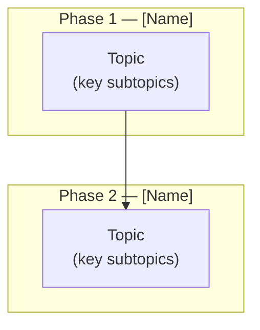

# Study Plan Generator

Generate a structured study plan showing what someone needs to learn to build this project manually, with a Mermaid prerequisite dependency graph.

## Step 1: Clarify Requirements

Use **AskUserQuestion** to ask these before doing any research:

```
Question 1 — Target audience
"Who is this study plan for?"
Options:
  A) Complete beginner (knows nothing about programming)
  B) Web developer (knows HTML/CSS/JS but not browser extensions or this stack)
  C) Experienced developer (knows the stack, needs to understand this project's specific patterns)

Question 2 — Scope
"What should the study plan cover?"
Options:
  A) Full path from scratch (all fundamentals through this project's patterns)
  B) Extension-specific and project-specific only (skip web fundamentals)
  C) Project-specific patterns only (architecture, async patterns, IPC design)
```

If the user invoked with arguments (`$ARGUMENTS`), use them to infer the output path. Otherwise default to `docs/study-plan.md`.

## Step 2: Analyze the Codebase

Read enough to answer:
- What languages, frameworks, and platform APIs does this project use?
- What are the non-obvious architectural patterns (state machines, concurrency guards, pool patterns, IPC protocols)?
- What async/concurrency hazards exist and how are they handled?
- What persistence/storage patterns are used?
- What are the entry points and the flow between components?

Use **Glob** and **Read** to scan:
- All source files (understand what each context/component does)
- Manifest or config files (permissions, entry points, constraints)
- Existing docs (ARCHITECTURE.md, README.md, spec.md, CLAUDE.md) — extract already-documented patterns rather than rediscovering them

## Step 3: Build the Prerequisite Tree

Identify every distinct knowledge area required to build the project. Group them into phases where each phase depends on all previous ones. For each node, name it precisely (e.g. "Canvas 2D + CORS taint" not just "Canvas").

**Dependency rule:** A → B means "you must understand A before you can learn B".

Render as a Mermaid `graph TD` diagram with `subgraph` blocks per phase:



Rules for the graph:
- Each node label includes 1-3 key subtopics in parentheses so it's self-explanatory
- Phases flow top-to-bottom
- Cross-phase dependencies are explicit arrows, not implied by phase order
- Keep it readable — max ~30 nodes total; merge closely related topics into one node

## Step 4: Write the Document

Structure:

```markdown
# Study Plan: Building [Project Name] from Scratch

[1-sentence description of what this project is and why the prerequisites matter]

---

## Dependency Tree

[Mermaid graph]

---

## Phase N — [Name]

**Goal:** [One sentence — what capability does completing this phase unlock?]

| Topic | What to master | Resource starting point |
|---|---|---|
| ... | ... | MDN / official docs link |

**Checkpoint:** [A concrete mini-project the learner can build to verify they understand this phase before moving on. Should be buildable in < 2 hours.]

[Repeat for each phase]

---

## [Project-Specific Patterns]

For any non-standard patterns this project uses (state machines, IPC protocols, concurrency guards, pool patterns), include a dedicated section with:
- What the pattern is
- Why it was chosen over simpler alternatives
- A minimal code sketch showing the essential structure
- What breaks if you skip it

---

## Common Mistakes to Avoid

A table of the specific gotchas this codebase guards against, with the correct pattern beside each.

---

## Reference Materials

Links to the authoritative docs for each major API or concept used.
```

**Tailoring by audience level:**
- **Beginner:** Include Phase 1 (web fundamentals) in full; add "what to read first" notes to each phase
- **Web developer:** Start from the platform/extension architecture phase; link fundamentals but don't detail them
- **Experienced developer:** Skip fundamentals and platform basics; focus entirely on project-specific patterns, IPC design, async hazards, and the dependency graph of design decisions

## Step 5: Save the File

Determine the output path:
1. If `$ARGUMENTS` was provided and looks like a file path, use it
2. Otherwise use `docs/study-plan.md`

Use **Write** to save the completed document. Confirm the path to the user.

## Success Criteria

- [ ] Mermaid graph has named phases as subgraphs with explicit dependency arrows
- [ ] Every phase has a concrete, time-bounded checkpoint project
- [ ] Project-specific patterns section covers all non-obvious design decisions
- [ ] Common mistakes table maps real gotchas to correct patterns
- [ ] Document is tailored to the chosen audience level
- [ ] File saved to the correct output path
