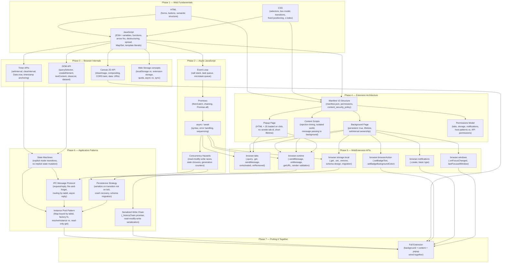

# Study Plan: Building Pomo from Scratch

A prerequisite map and learning curriculum for someone who wants to build this Firefox WebExtension manually. Each phase depends on everything above it.

---

## Dependency Tree



---

## Phase 1 — Web Fundamentals

**Goal:** Write a static interactive web page from scratch.

| Topic | What to master | Resource starting point |
|---|---|---|
| HTML | Forms, buttons, semantic tags, `data-*` attributes | MDN: HTML basics |
| CSS | Box model, `position: fixed`, `z-index`, `transition`, CSS variables (`--var`), `classList` manipulation | MDN: CSS first steps |
| JavaScript (ES6+) | `let`/`const`, arrow functions, destructuring, spread, `Map`, `Set`, template literals, modules | MDN: JavaScript Guide |

**Checkpoint:** Build a countdown timer UI in a plain HTML file — no extensions, no APIs. Click Start, watch a number count down, show a "Done" message.

---

## Phase 2 — Async JavaScript

**Goal:** Understand how JavaScript handles time and concurrency.

| Topic | What to master |
|---|---|
| Event loop | Why JS is single-threaded; call stack vs. task queue vs. microtask queue |
| Promises | `.then()` / `.catch()`, chaining, `Promise.all`, `Promise.resolve()` |
| `async` / `await` | Syntax, error handling with `try/catch`, sequential vs. parallel awaits |
| Concurrency hazards | **Read-modify-write races** (two reads before either write = lost update); **stale closures** (callback fires after state changed); **generation counters** (cancel stale async results) |

**Checkpoint:** Implement `appendToHistory` with a promise chain that prevents two concurrent callers from clobbering each other's write:

```js
let chain = Promise.resolve();
function append(entry) {
  chain = chain.then(async () => {
    const data = await read();
    data.push(entry);
    await write(data);
  });
}
```

---

## Phase 3 — Browser Internals

**Goal:** Use raw browser APIs before touching extensions.

| Topic | What to master |
|---|---|
| DOM API | `querySelector`, `createElement`, `textContent` (never `innerHTML` for untrusted data), `classList.toggle`, `dataset`, `replaceChildren` |
| Canvas 2D | `getContext("2d")`, `drawImage`, compositing; understand CORS taint — `ctx.drawImage` on a cross-origin image throws; wrap in `try/catch` |
| Timer APIs | `setInterval` / `clearInterval`; wall-clock anchoring: store `startTimestamp = Date.now()` and compute elapsed as `Date.now() - startTimestamp` rather than a running counter (survives page hides, restarts) |
| Storage concepts | Why `localStorage` is synchronous and extension storage is async; the quota model |

**Checkpoint:** Build a canvas favicon composer — load an image, draw it on a 32×32 canvas, composite a colored dot in the corner, export as a `data:` URI. Handle CORS failures gracefully.

---

## Phase 4 — Extension Architecture

**Goal:** Understand the three-context model before writing any code.

### The three contexts and their constraints

```
┌──────────────────────────────────┐
│  Background Page                 │
│  Lives as long as the extension  │
│  Owns setInterval handles        │
│  No DOM access to any page       │
└──────────┬───────────────────────┘
           │ message passing only
    ┌──────┴──────┐
    ▼             ▼
Content Script   Popup Page
Runs in tabs     Runs on toolbar click
Has DOM access   Has its own DOM
No tab.id in bg  No sender.tab.id
```

| Context | Lifetime | Can access page DOM | Has `sender.tab.id` |
|---|---|---|---|
| Background page | Always (persistent: true) | No | From content script messages only |
| Content script | Tab lifetime | Yes (injected) | Yes, via `sender` in background |
| Popup | While popup is open | Own popup DOM only | No — must query active tab |

**Critical manifest.json fields to understand:**

```json
{
  "background": { "scripts": [...], "persistent": true },
  "content_scripts": [{ "matches": [...], "run_at": "document_end" }],
  "permissions": ["tabs", "storage", "notifications"],
  "content_security_policy": "script-src 'self'; ..."
}
```

`persistent: true` — if you remove this, Firefox may suspend the background page, destroying all `setInterval` handles. You'd need `browser.alarms` instead.

**Checkpoint:** Create a minimal 3-file extension: background logs "alive", content script logs its URL, popup displays "hello". Wire them together with one message each way.

---

## Phase 5 — WebExtension APIs

**Goal:** Learn the specific APIs this extension uses.

### `browser.tabs`

```js
// Find the currently focused tab
browser.tabs.query({ active: true, lastFocusedWindow: true })
// DO NOT use { active: true, currentWindow: true } in background listeners —
// "currentWindow" means the window that sent the event, not the focused one.

browser.tabs.get(tabId)           // verify a tab still exists
browser.tabs.sendMessage(tabId, msg)  // push to a specific tab's content script
browser.tabs.onActivated.addListener(({ tabId }) => { ... })
browser.tabs.onRemoved.addListener((tabId) => { ... })
```

### `browser.runtime`

```js
// Background receives
browser.runtime.onMessage.addListener((msg, sender, reply) => {
  // sender.id — validate this: if (sender.id !== browser.runtime.id) return false
  // sender.tab.id — only present when sent from a content script
  // return true — ONLY if you will call reply() asynchronously
  // return false — for synchronous replies or no reply
});

// Content / popup sends
browser.runtime.sendMessage({ type: "...", ...payload })
```

### `browser.storage.local`

```js
// Always async — always await
const stored = await browser.storage.local.get(["key1", "key2"]);
await browser.storage.local.set({ key1: value });
await browser.storage.local.remove("oldKey"); // for schema migrations
```

### `browser.browserAction` (badge)

```js
browser.browserAction.setBadgeText({ text: "25" });       // "" to clear
browser.browserAction.setBadgeBackgroundColor({ color: "#E05A4A" });
// Cache the last text to avoid redundant calls — setBadgeText is not free
```

**Checkpoint:** Build an extension that shows a live clock in the badge (`12:34`) and updates it every second using `setInterval` in the background page.

---

## Phase 6 — Application Patterns

**Goal:** Learn the design patterns this extension actually uses.

### State machine

A timer has exactly four modes: `idle → work → break/longBreak → idle`. Represent this explicitly — no booleans like `isRunning` or `isPaused` that can combine into impossible states.

```js
// Good: one source of truth for mode
inst.mode = "work" | "break" | "longBreak" | "idle"

// Bad: multiple flags
let isRunning = true; let isPaused = false; // can be isRunning && isPaused — what does that mean?
```

### Timestamp anchoring (crash-resilient elapsed time)

```js
// On start:
inst.startTimestamp = Date.now();

// On every read:
function currentElapsed(inst) {
  if (inst.autoPaused) return inst.elapsedMs; // snapshot taken at pause
  return Date.now() - inst.startTimestamp;    // live computation
}

// On pause:
inst.elapsedMs = currentElapsed(inst);
inst.autoPaused = true;

// On resume:
inst.startTimestamp = Date.now() - inst.elapsedMs; // re-anchor
inst.autoPaused = false;
```

Why: if the browser restarts, `Date.now() - storedStartTimestamp` still gives correct elapsed. A simple decrementing counter would be lost.

### IPC message routing

```js
// Background: route by msg.tabId
browser.runtime.onMessage.addListener((msg, sender, reply) => {
  switch (msg.type) {
    case "GET_STATE": {
      const inst = timers.get(msg.tabId); // READ ONLY — do not create here
      reply(inst ? publicState(inst) : idlePublicState());
      return false;
    }
    case "START": {
      const inst = resolveInstance(msg.tabId); // CREATE if absent
      startSession(inst, msg.mode || "work");
      reply({ ok: true });
      return false;
    }
  }
});

// Popup: resolve tabId BEFORE sending — popup has no sender.tab.id
browser.tabs.query({ active: true, currentWindow: true }).then(([tab]) => {
  currentTabId = tab?.id ?? null;
  return browser.runtime.sendMessage({ type: "GET_STATE", tabId: currentTabId });
}).then(renderTimerState);
```

### Instance pool pattern

```js
function createTimerInstance(tabId) {
  return { tabId, mode: "idle", startTimestamp: null, elapsedMs: 0,
           sessionDuration: null, autoPaused: false, tickInterval: null, ... };
}

const timers = new Map(); // Map<tabId, TimerInstance>

function resolveInstance(tabId) {   // use only for mutating actions
  if (!timers.has(tabId)) timers.set(tabId, createTimerInstance(tabId));
  return timers.get(tabId);
}
```

**Why a factory instead of a class:** the instance is a plain object. It gets serialized to storage (minus `tickInterval`), spread with `Object.assign` on restore, and iterated as `for (const [tabId, inst] of timers)`. A class would add no value and make serialization awkward.

### Serialized write chain

```js
let _historyChain = Promise.resolve();

function appendToHistory(entry) {
  _historyChain = _historyChain.then(async () => {
    const stored = await browser.storage.local.get("history");
    const history = stored.history || [];
    history.push(entry);
    await browser.storage.local.set({ history });
  });
  return _historyChain;
}
```

Two timers completing simultaneously both call `appendToHistory`. Without the chain, both would read the same stale array and one write would be lost. The chain ensures the second read never starts until the first write completes.

**Checkpoint:** Implement the full background timer: `startSession`, `tick`, `onSessionComplete`, `stopSession`, `persistState`, `init` (with crash recovery). No popup yet — test by sending messages from the browser console.

---

## Phase 7 — Putting It Together

By this point you have all the pieces. The integration work:

1. **Wire background → content:** `broadcastState(inst)` calls `browser.tabs.sendMessage(inst.tabId, { type: "UPDATE_BAR", state })`. Content script's `applyState` reads `state.mode` and sets `data-mode` on the bar element (CSS transitions do the rest).

2. **Wire background → popup:** `broadcastState` also calls `browser.runtime.sendMessage({ type: "STATE_UPDATE", tabId: inst.tabId, state })`. Popup listener ignores updates where `msg.tabId !== currentTabId`.

3. **Favicon overlay:** On `CONTENT_READY` response, content script gets initial state. `faviconOverlay.apply(mode)` loads the page favicon as an `Image`, composites a dot onto a shared 32×32 canvas, and sets the `<link rel="icon">` href to the resulting `data:` URI. Generation counter prevents stale `onload` from overwriting after mode changes.

4. **Debounce paired listeners:** `onActivated` and `onFocusChanged` both fire within milliseconds of a window switch. One 50 ms `setTimeout` collapses them into a single `checkBoundTabActivity` call.

5. **Schema migration:** `init()` checks for the old key `timerState` (singular). If found and no `timerStates` (plural) exists, extract `pomodoroCount`, delete the old key, proceed without restoring the old timer (tab IDs don't survive browser restarts).

---

## Common mistakes to avoid

| Mistake | Correct pattern |
|---|---|
| Calling `persistState()` from `tick()` | Only call on genuine state transitions |
| Using `innerHTML` for domain names | Use `textContent` — domain names are untrusted strings |
| Spreading `msg.settings` directly into `settings` | Destructure only known keys, then sanitize |
| Omitting `return true` for async replies | Required if you call `reply()` after an `await` |
| `browser.tabs.query({ currentWindow: true })` in a background listener | Use `lastFocusedWindow: true` instead |
| Reading `inst.mode` after an `await` in `logSession` | Snapshot all mutable fields synchronously before the first `await` |
| Calling `resolveInstance()` from `GET_STATE` | Creates a ghost instance for every popup open; use `timers.get()` read-only |

---

## Reference materials

- [MDN: WebExtensions documentation](https://developer.mozilla.org/en-US/docs/Mozilla/Add-ons/WebExtensions)
- [MDN: browser.runtime.onMessage — return values](https://developer.mozilla.org/en-US/docs/Mozilla/Add-ons/WebExtensions/API/runtime/onMessage#return_value)
- [MDN: tabs.query](https://developer.mozilla.org/en-US/docs/Mozilla/Add-ons/WebExtensions/API/tabs/query)
- [MDN: CanvasRenderingContext2D.drawImage — CORS](https://developer.mozilla.org/en-US/docs/Web/API/CanvasRenderingContext2D/drawImage)
- [Firefox Extension Workshop: MV2 persistent background pages](https://extensionworkshop.com/documentation/develop/manifest-v3-migration-guide/)
- [MDN: Document: visibilitychange event](https://developer.mozilla.org/en-US/docs/Web/API/Document/visibilitychange_event)
